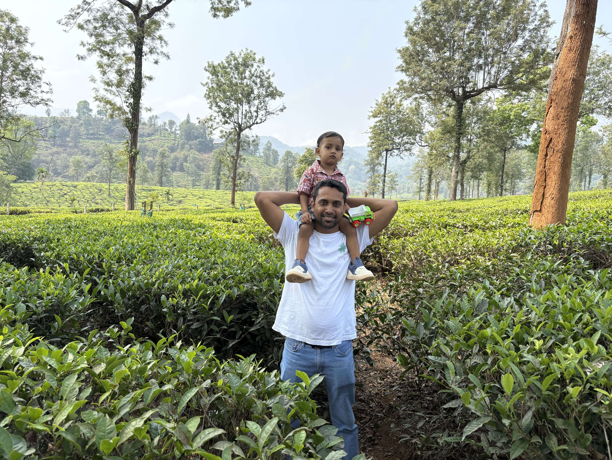
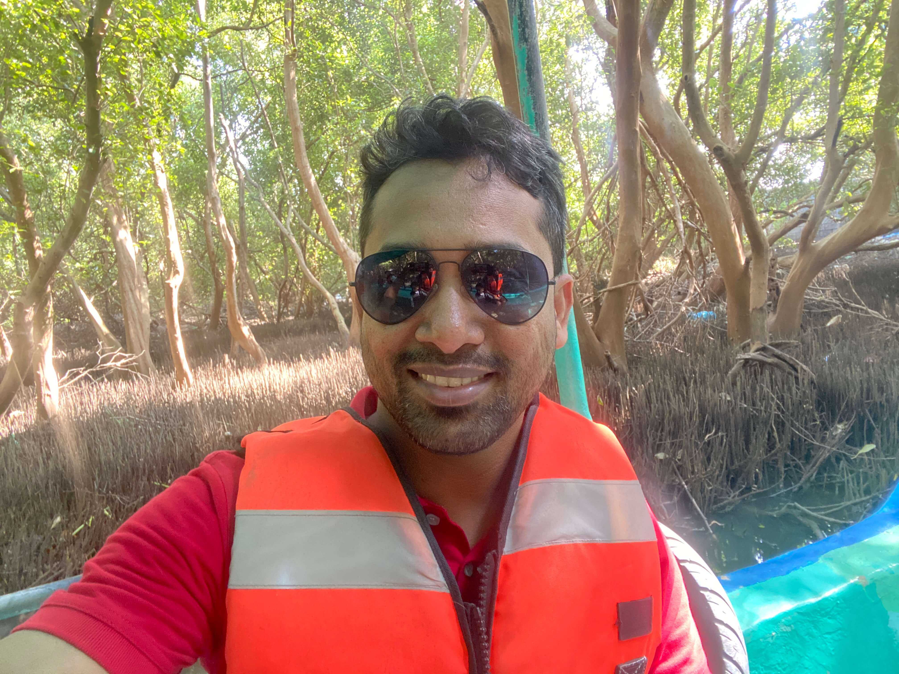

<section class="personal-hero" id="top">
  

    
Ravi Shankar · Applied AI Engineer

    <h1>Building with AI. Learning it from the inside out.</h1>
    

      My work has long lived in Applied AI—turning models into useful, reliable systems.
      Increasingly, I am going deeper into core AI and machine learning: the mathematics,
      architectures, and ideas beneath the applications.
    

    

      <a class="hero-primary" href="#five-themes">Explore my work</a>
      <a href="https://www.linkedin.com/in/ravi-shankar-a725b0225/">LinkedIn ↗</a>
      <a href="/resume.pdf">Resume ↗</a>
    

  

  

    <figure class="hero-photo photo-wayanad">
      
      <figcaption>Wayanad</figcaption>
    </figure>
    <figure class="hero-photo photo-goa">
      
      <figcaption>Goa</figcaption>
    </figure>
    <figure class="hero-photo photo-pondi">
      
      <figcaption>Pondicherry</figcaption>
    </figure>
  

</section>

<section id="five-themes" class="story-stack" aria-label="Five themes">
  <article class="story-band salesforce-band">
    

      
Professional work

      <h2>Applied AI at Salesforce</h2>
      
Where AI has to leave the demo and become dependable infrastructure.

    

    

      

        I build AI in real systems, where scale, reliability, observability, and practical
        usefulness matter as much as the model itself. This is where my interest in Applied AI
        is tested against the complexity of production.
      

      <a href="https://www.salesforce.com/">About Salesforce ↗</a>
    

  </article>

  <article class="story-band kavriq-band">
    

      
Learning & teaching

      <h2>Kavriq</h2>
      
Understanding modern AI from first principles—and teaching it clearly.

    

    

      

        Kavriq explores the mathematics, models, and software systems behind modern AI through
        structured learning paths, engineering references, essays, and video.
      

      

        <a href="https://kavriq.com/">Visit Kavriq ↗</a>
        <a href="https://www.youtube.com/@kavriq">YouTube ↗</a>
      

    

  </article>

  <article class="story-band murali-band">
    

      
Open-source engineering

      <h2>Murali Engine</h2>
      
A precise visual language for mathematical and AI explanations.

    

    

      

        Murali is a JavaScript-based animation system. It combines deterministic timelines
        with modern web rendering to create mathematical lessons and AI explainers.
      

      <a href="https://muraliengine.com/">Explore Murali ↗</a>
    

  </article>

  <article class="story-band bharat-band">
    

      
Roots & culture

      <h2>Pranam Bihar</h2>
      
Looking at an old land with fresh eyes.

    

    

      

        A celebration of Bihar’s people, places, history, food, and living culture—telling
        richer stories about where I come from and helping those stories travel.
      

      <a href="https://pranambihar.com/">Discover Bihar ↗</a>
    

  </article>

  <article class="story-band bihar-band">
    

      
India’s future

      <h2>Vision for Bharat, 2075</h2>
      
Ideas worth preserving beyond the urgency of the present moment.

    

    

      

        A long-view civic journal of constructive ideas, structural blueprints, and questions
        worth carrying into India’s future. It is a place for proposals, scrutiny, and revision.
      

      <a href="https://visionforbharat.com/">Read the journal ↗</a>
    

  </article>
</section>

<footer class="personal-footer">
  

    <a class="footer-name" href="#top">Ravi Shankar</a>
    
Every day, a little better than yesterday.

    <small>Keep learning. Keep building. Keep moving forward.</small>
  

  <nav aria-label="Projects">
    Explore
    <a href="https://kavriq.com/">Kavriq</a>
    <a href="https://muraliengine.com/">Murali Engine</a>
    <a href="https://visionforbharat.com/">Vision for Bharat</a>
    <a href="https://pranambihar.com/">Pranam Bihar</a>
  </nav>
  <nav aria-label="Connect">
    Connect
    <a href="https://www.linkedin.com/in/ravi-shankar-a725b0225/">LinkedIn</a>
    <a href="/resume.pdf">Resume</a>
    <a href="https://www.youtube.com/@RaviShankar-sn2kc/featured">Personal YouTube</a>
    <a href="mailto:info@ravishankarkumar.com">Email</a>
  </nav>
  

    © 2016–2026 Ravi Shankar
    Bengaluru, India
  

</footer>
